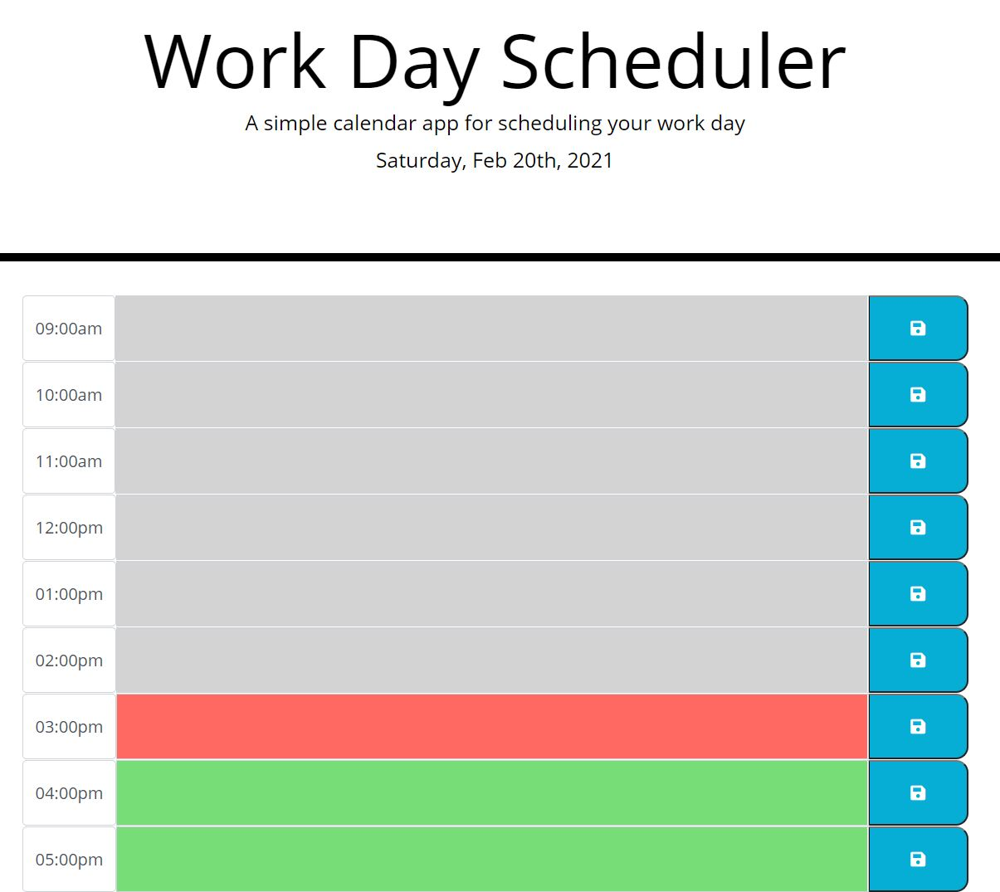

# Work-Day-Scheduler

AS AN employee with a busy schedule
I WANT to add important events to a daily planner
SO THAT I can manage my time effectively

## Table of contentens

* [Description](#Description)
* [Instalation](#Instalation)
* [Screenshot](#Screenshot) 
* [Credits](#Credits)

## Description

This is a simple calendar application that allows the user to save events for each hour of the day. This app will run in the browser and feature dynamically updated HTML and CSS powered by jQuery. The application contains a work day of 9AM – 5PM, and has areas for entering notes to help the user keep track of their busy schedule. The top of the planner always contains the current date, without the user having to look that up.

## Instalation

- [Link to Github Repository](https://github.com/Lauracejas/Work-Day-Scheduler)

- [Link to deployed website](https://lauracejas.github.io/Work-Day-Scheduler/)

## Resources

- I used the [Moment.js](https://momentjs.com/) library to work with date and time.
- [Bootstrap](https://getbootstrap.com/docs/4.0/components/jumbotron/)
- [Google](https://www.google.com/)
- [jQuery](https://api.jquery.com/)

## Screenshot

